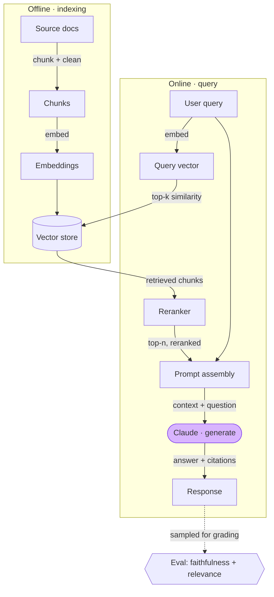
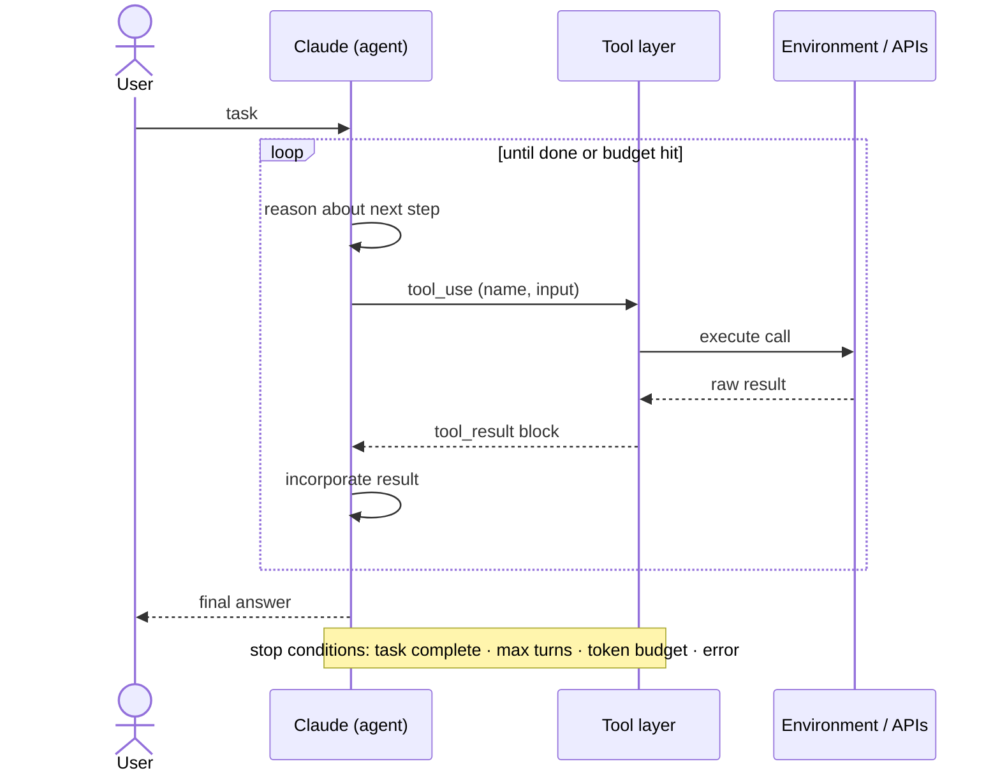
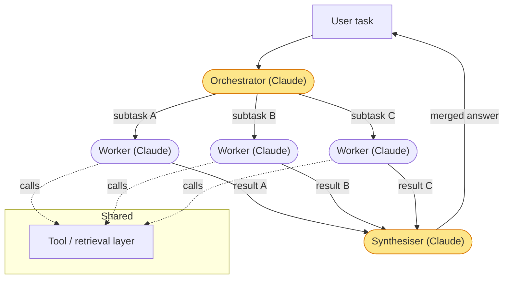
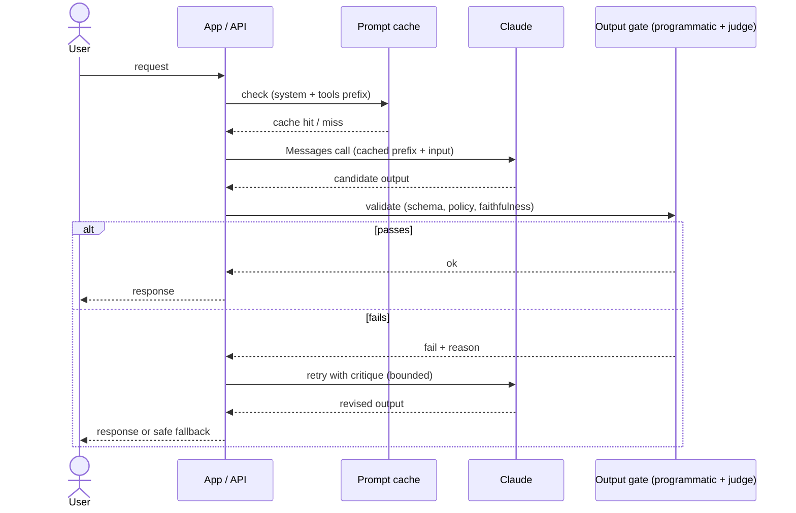
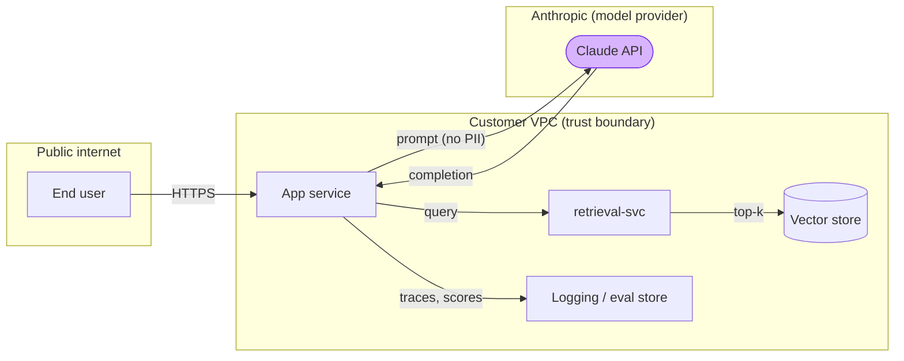

# Architecture diagrams

A diagram is an argument about how a system fits together, not decoration. If you can't draw it cleanly, you don't understand the boundaries yet. This file covers how to produce diagrams that earn their place: which type for which job, the conventions that separate a useful diagram from a box-and-arrow mess, and ready-to-paste Mermaid snippets.

## Why Mermaid

Use **Mermaid** as the default. It's text, so it diffs in git, lives next to the code, and there's no binary to keep in sync with reality. It renders natively in Obsidian, in GitHub markdown, in GitLab, in most docs platforms, and in the Anthropic-flavoured tooling you'll hand to customers. The alternative (draw.io / Excalidraw / Figma) makes prettier pictures but rots the instant the system changes, because nobody opens the editor. A slightly uglier diagram that's correct beats a beautiful one that's six months stale.

When you genuinely need a polished system-context picture for a deck, export from Mermaid first and prettify second, so the source of truth stays in text.

## Which diagram type for which job

One question per diagram. Pick the type that answers *that* question:

| You're showing... | Use | Mermaid type |
|---|---|---|
| How data / control flows through components | Flowchart | `flowchart` / `graph` |
| The order of interactions over time (an agent loop, an API handshake, retries) | Sequence diagram | `sequenceDiagram` |
| The system in its context — who calls it, what it depends on (C4 "container" level) | Container view | `flowchart` with subgraphs (or `C4Container`) |
| A lifecycle / state machine (a job's states, a conversation's modes) | State diagram | `stateDiagram-v2` |
| Entities and their relationships (a data model) | ER diagram | `erDiagram` |

The two you'll reach for most when documenting AI systems: **flowchart** for "here's the RAG/extraction pipeline and where the data goes", and **sequenceDiagram** for "here's the agent loop / the request-with-eval-gate over time". Reach for a sequence diagram the moment *ordering and back-and-forth* is the point — a flowchart flattens time and an agent loop is all about time.

## Conventions (the difference between signal and noise)

1. **Label every edge.** An unlabelled arrow says "these connect", which the reader already assumed. A labelled arrow says *what flows*: `--"top-k chunks"-->`, `--"tool_use block"-->`, `--"cache hit"-->`. The labels are where the information is.
2. **One level of abstraction per diagram.** Don't put a box called "AWS" next to a box called "the retry loop". If a component needs detail, give it its own diagram and link down. A reader can hold one altitude at a time.
3. **Show trust boundaries.** Draw a `subgraph` around what you control vs the customer's VPC vs the public internet vs the model provider. For any system touching sensitive data this is the first thing a security reviewer looks for, and it's the first thing most diagrams omit. Mark where data crosses a boundary.
4. **Direction carries meaning.** Top-to-bottom (`TD`) for pipelines and request flow; left-to-right (`LR`) for stages over time or when boxes have long labels. Be consistent within a doc.
5. **Name things the way the code names them.** If the service is `retrieval-svc` in the repo, don't call it "Search Layer" in the diagram. The diagram is a map; a map with different place-names than the territory is worse than none.
6. **Cap the box count.** Past ~12 boxes a single diagram stops being readable. Split it: a context diagram on top, detail diagrams below. If you're tempted to add a 15th box, you've found a sub-diagram.
7. **Distinguish the LLM call visually.** In an AI architecture, *where the model is invoked* is the load-bearing fact. Give LLM/agent nodes a distinct shape or style (`style` / a stadium shape) so the eye finds them and the cost/latency lives where the calls are.

## Ready-to-paste snippets

All of these are valid Mermaid. The full set, plus headers, also lives in `templates/diagrams.mmd`.

### RAG pipeline (flowchart)

Data flow for retrieval-augmented generation. Note the two phases (offline indexing, online query) and the eval point.



### Agent loop (sequence diagram)

The reason-act loop over time. Sequence diagram because the back-and-forth *is* the point.



### Multi-agent orchestrator-workers (flowchart)

The orchestrator decomposes, fans out to workers, synthesises. Use when subtasks are independent and parallelisable.



### LLM request flow with an eval gate (sequence diagram)

A production request path where output is checked before it reaches the user. The gate is the part most architectures skip and most reviewers ask about.



### System context with trust boundaries (flowchart, container level)

The C4-ish "container" altitude: what talks to what, and where the boundaries are. One level up from the pipeline diagrams above.



## Common Mermaid gotchas (so your diagram actually renders)

- **Edge labels with special characters** must be quoted: `A -->|"top-k (k=20)"| B`. Parentheses and colons in an unquoted label break the parse.
- **Node text with parentheses or punctuation** needs quotes inside the shape: `LLM(["Claude · generate"])`, not `LLM([Claude (generate)])`.
- `stadium` shape is `([text])`, `subroutine` is `[[text]]`, `cylinder/db` is `[(text)]`, `hexagon` is `{{text}}`, `diamond/decision` is `{text}`. Mismatched brackets are the #1 render failure.
- In `sequenceDiagram`, declare participants before use if you want a specific order/alias; `alt`/`loop`/`opt` blocks must be closed with `end`.
- Keep one diagram per fenced block. Don't put two graphs in one ```mermaid fence.
- Validate before shipping: paste into the [Mermaid Live Editor](https://mermaid.live) or preview in Obsidian. A diagram that doesn't render is worse than none.

## What a careful reader presses on

- "Where does the data cross a trust boundary?" — if your diagram has no boundaries drawn, expect to add them live. Draw them first.
- "What happens when the LLM call fails / the tool errors / retrieval returns nothing?" — happy-path-only diagrams invite the question. Show at least one failure edge (the eval-gate and agent-loop snippets above do).
- "Why is this an agent and not a workflow here?" — the diagram should make the choice visible (a loop with a stop condition vs a fixed DAG). See `reference/tradeoff-docs.md` for the decision write-up.
- "What's the latency/cost on the critical path?" — annotate the LLM calls; that's where both live.
